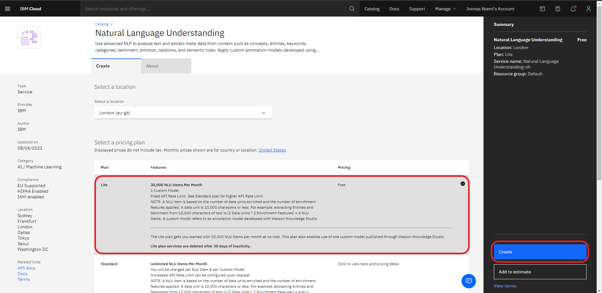

# Scraping data from Reddit and Twitter data and Using IBM Watson tools to extract features

This code is used to gather data related to selfcare methods for back pain from Reddit and Twitter as dataset, and use IBM Watson Tone Analyzer and  Natural Language Understanding (NLU) to gain insight from the texts.

NLU features a set of analytics features to extract meanings from unstructured data such as text. Tone Analyzer on the other hand extracts tone of the text.

So far in this code NLU is used to extract Part-of-speech features (adjectives, nouns and verbs) from the text to build wordclouds. However tones extracted via Tone Analyzer are appended as part of the dataset.

# Pre-requirements

1. [Python](https://www.python.org/downloads/release/python-394/
) (version 3.9.4)
2. Install required python packages:
    ```powershell
      pip install -r requirements.txt
      ```
3. Clone repository locally
    ```powershell
    git clone https://github.com/JoonasAN/Reddit-Twitter-Scraping-NLP-Watson.git
    ```
# Setup
1. [Twitter Sraping Via Tweepy](#1-twitter-scraping-via-tweepy)
2. [Reddit Scraping Via PushshiftAPI](#2-reddit-scraping-via-pushshiftapi)
3. [Create IBM Cloud Account](https://cloud.ibm.com)
4. [Create Watson Services](#4-create-watson-services)

## 1. Twitter Scraping Via Tweepy
### 1.1 Developer Access
1. Apply for Developer Access in [Twitter Developer](https://developer.twitter.com/en/docs/twitter-api/getting-started/getting-access-to-the-twitter-api) page and follow instructions there to create project and app.
2. To find/generate credencials go to developer dashboard `Projects & Apps` > `Overview` and press Key icon on your project app in middle of the screen. Here you can find/generate credencials. Make sure you save them.
3. In developer portal dashboard, navigate to `Products` > `Premium` > `Dev Environments` tab on the left and choose a subscription API you want to use.
4. Give label and app to Subscription API.
   
### 1.2 Usage

1. Find `twitter_search.py` file from repository.
2. Choose at least one output format in `write_tweets_30()`-function with parameters:
    ```python
        get_json = True # returns JSON-file that includes all features.
        get_csv = True  # returns CSV-file that includes features columns specified in write_tweets_30 function
        ```
3. Run script.
4. Give a name to file(s) when prompted

## 2. Reddit Scraping Via PushshiftAPI
1. Run `reddit_search.py` script.


## 3. Create IBM Cloud Account
Create Account at the [IBM Cloud website](https://cloud.ibm.com).

## 4. Create Watson Services
Following instructions show how to create Watson services.

### 4.1 Create Natural Language Understanding Service

1. On IBM Cloud, create a [Natural Language Understanding](https://cloud.ibm.com/catalog/services/natural-language-understanding) service by clicking link or navigating to catalog tab and searching "Natural Language Understanding".
2. Under `Select a pricing` plan select `Lite` and click `create`.



3. In Natural Language Understanding dashboard, open `Services Credentials` tab from left side of the screen, and
click `New credential`. After creating credencials copy them by clicking two overlapping squares and paste them in [naturallanguageunderstanding.json](./Reddit/V2/NLP/naturallanguageunderstanding.json) found in repository.


### 4.2 Create Tone Analyzer Service

To create Tone Analyzer service and credencials, follow the same rules as NLU service and credensials creation.

1. On IBM Cloud, create a [Tone Analyzer](https://cloud.ibm.com/catalog/services/tone-analyzer) service by clicking link or navigating to catalog tab and searching "Natural Language Understanding".
2. Under `Select a pricing` plan select `Lite` and click `create`.

3. In Tone Analyzer dashboard, open `Services Credentials` tab from left side of the screen, and
click `New credential`. After creating credencials copy them by clicking two overlapping squares and paste them in [toneanalyzer.json](./Reddit/V2/NLP/toneanalyzer.json) found in repository.


# Run Order
1. twitter_search.py and reddit_search.py
2. calculate_complexity.py (for both reddit and twitter data)
3. Watson_Tone.py
4. Watson_NLU.py
5. make_wordclouds.py

# Misc
Repository has misc.py-file which has some unfinished/unused funtions.

